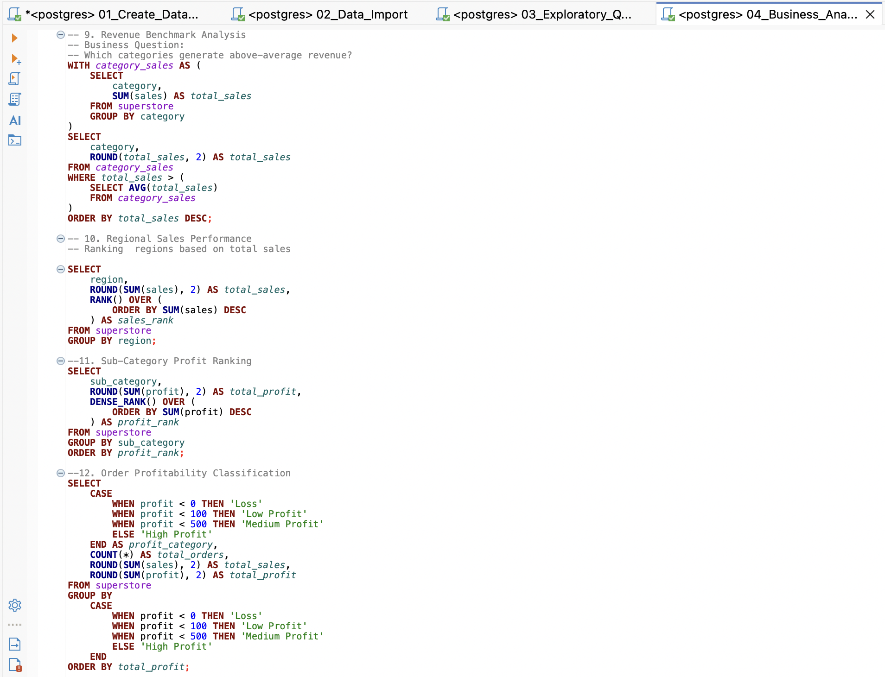
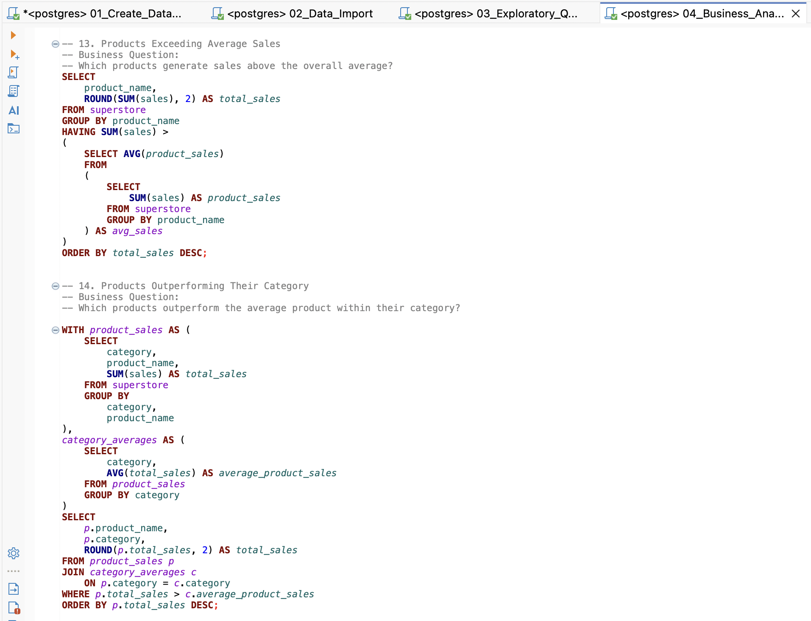
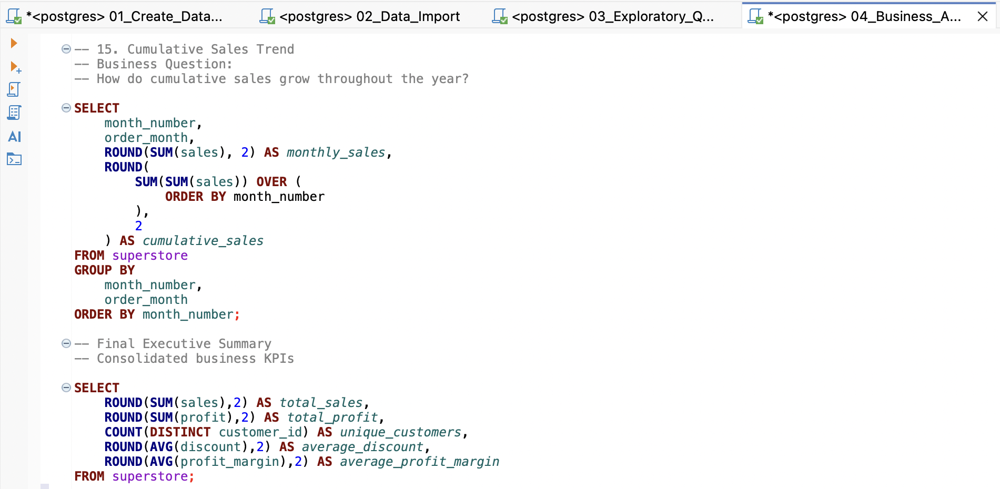
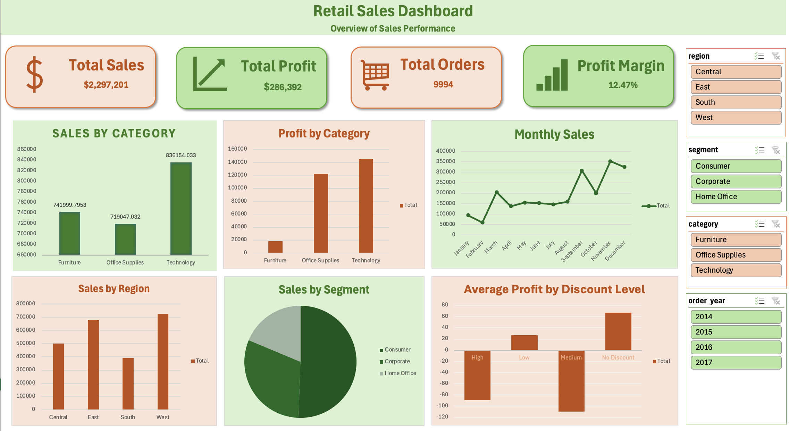
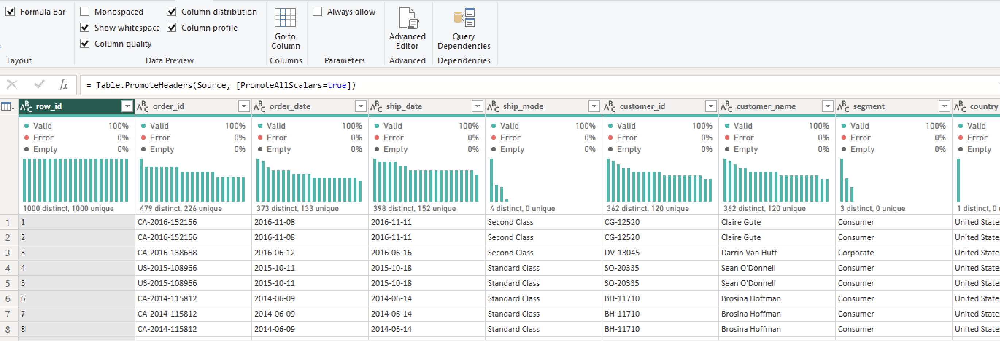
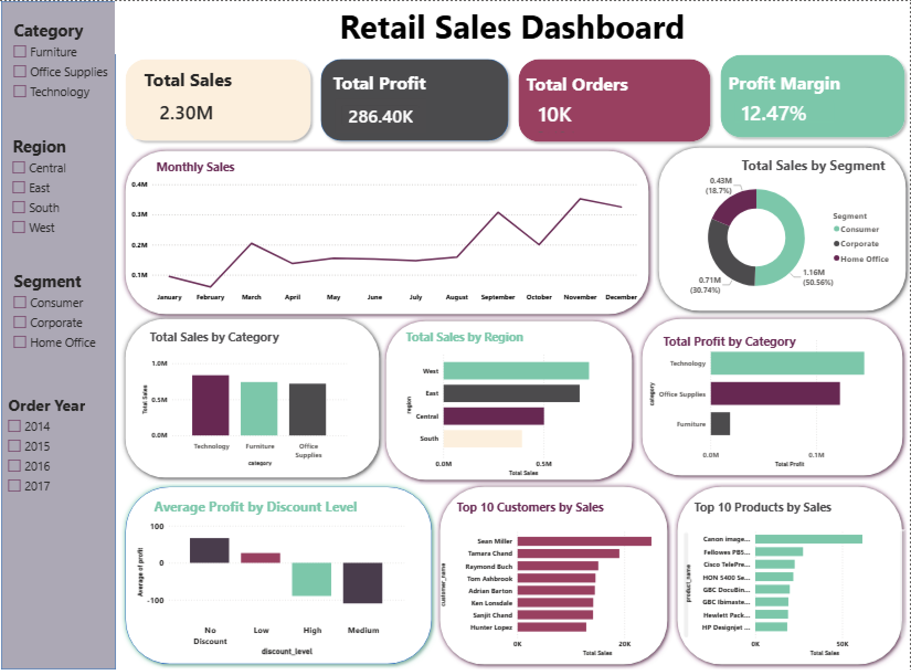
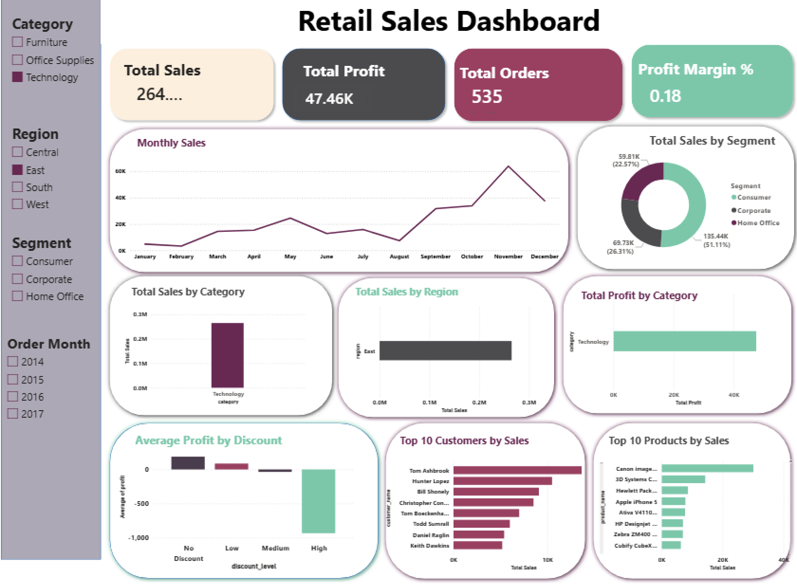

# Retail Sales Analytics

An end-to-end retail sales analytics project using Python, SQL, Excel, and Power BI to analyze sales performance, profitability, customers, discounts, products, regions, and shipping.

---

## Project Overview

This project analyzes the Sample Superstore dataset to identify business trends, evaluate sales and profitability, and develop interactive dashboards.

The project follows an end-to-end analytics workflow:

**Data → Python → Feature Engineering → SQL → Excel → Power BI → Business Insights**

The analysis focuses on answering key business questions related to:

- Sales performance
- Profitability
- Discounts
- Customers
- Products
- Regional performance
- Time trends
- Shipping performance

---

## Tools & Technologies

- Python
- Pandas
- PostgreSQL
- DBeaver
- Excel
- Power Query
- Power BI
- DAX

---

## Project Workflow

1. Data loading and validation
2. Data cleaning using Python
3. Exploratory Data Analysis (EDA)
4. Feature engineering
5. Loading the cleaned dataset into PostgreSQL
6. SQL business analysis
7. Excel dashboard development
8. Power BI dashboard development
9. Business insights and recommendations

---

## Python Data Analysis

Python was used to clean, explore, and prepare the dataset for further analysis.

### Data Cleaning

The data preparation process included:

- Standardizing column names
- Converting date columns to the correct data types
- Checking for missing values
- Checking data types
- Preparing the dataset for database analysis

### Exploratory Data Analysis

The analysis examined relationships between:

- Sales and Profit
- Discount and Profit
- Quantity and Sales
- Sales distribution
- Profit distribution
- Discount distribution

### Feature Engineering

Additional analytical features were created, including:

- Order Year
- Order Month
- Month Number
- Quarter
- Day of Week
- Shipping Days
- Profit Margin
- Discount Level
- Sales Category
- Order Size

---

## SQL Business Analysis

The cleaned dataset was loaded into PostgreSQL and analyzed using SQL to answer business-focused questions.

The analysis covers:

- Revenue analysis
- Profitability analysis
- Discount analysis
- Customer analysis
- Time analysis
- Shipping analysis
- Regional performance
- Executive KPIs

### SQL Techniques Used

- Aggregate functions
- `GROUP BY`
- `HAVING`
- `CASE`
- Common Table Expressions (CTEs)
- Subqueries
- `RANK()`
- `DENSE_RANK()`
- Window functions
- Running totals
- Analytical views

### Advanced SQL Queries

### SQL Subqueries

### Cumulative Sales Analysis

---

## Excel Dashboard

An interactive Excel dashboard was created using:

- PivotTables
- PivotCharts
- Slicers
- KPI cards

The dashboard provides an overview of sales, profitability, regional performance, customers, products, and discount levels.

---

## Power Query

Power Query was used to validate and prepare the dataset before building the Power BI dashboard.

The preparation included:

- Checking column quality
- Verifying data types
- Checking for errors and missing values
- Confirming date fields
- Verifying numerical fields
- Applying required transformations

---

## Power BI Dashboard

The Power BI dashboard provides an interactive overview of the main business performance indicators.

### Key KPIs

- Total Sales
- Total Profit
- Total Orders
- Profit Margin

### Dashboard Visualizations

- Monthly Sales Trend
- Sales by Category
- Sales by Region
- Sales by Segment
- Profit by Category
- Profitability by Discount Level
- Top Customers
- Top Products

### Interactive Filters

The dashboard includes slicers that allow users to filter the analysis by different dimensions such as:

- Region
- Category
- Segment
- Order Year

### Dashboard

### Interactive Filtering

The dashboard updates dynamically when filters are applied.

---

## Key Business Insights

### Sales Performance

- **Technology generated the highest total sales** at $836154.10 among the three product categories.
- **[The west region]** generated the highest regional sales at $725457.93, while **[south region]** generated the lowest.
- **[November]** recorded the highest monthly sales at $352461.09, indicating a seasonal variation in demand.
- **[Consumer segment]** was the largest contributor to total sales at $1161401.34.

### Profitability

- **[The technology category]** generated the highest total profit at $145455.66.
- **[Tables, bookcases, supplies]** generated negative total profit and should be investigated.
- High sales do not always translate into high profitability, as some products/orders generate substantial sales but relatively low or negative profit.
- The **[Copiers sub-category]** was the most profitable sub-category based on total profit at $55617.90.

### Discount Impact

- Higher discount levels were generally associated with lower average profit.
- **[The Medium]** generated the lowest average profit.
- Some orders receiving high discounts resulted in negative profit, indicating that aggressive discounting can reduce profitability.

### Customer Performance

- **[Sean Miller]** was the highest-value customer based on total sales at $25043.07.
- A relatively small number of customers contributed a significant share of total revenue.
- Identifying high-value customers can support targeted retention and loyalty strategies.

### Regional Performance

- **[The west region]** generated the highest sales and generated the highest profit.
- Regional sales and profitability do not always follow the same pattern, highlighting the importance of evaluating both revenue and profit.

### Shipping Performance

- **[Standard Class]** was the most frequently used shipping method.
- **[Same Day]** had the lowest average shipping time.
- Shipping mode usage and delivery time can help identify opportunities for operational improvement.

---

## Business Recommendations

Based on the analysis:

1. Review heavily discounted orders that generate low or negative profit.
2. Investigate consistently unprofitable sub-categories.
3. Prioritize profitable products and categories.
4. Develop targeted strategies for high-value customers.
5. Use seasonal sales patterns to support inventory and promotional planning.
6. Monitor regional profitability instead of relying only on sales volume.
7. Evaluate shipping performance when making operational decisions.

---

## Project Goals

This project demonstrates practical skills in:

- Data cleaning
- Exploratory data analysis
- Feature engineering
- SQL
- Business analysis
- Data visualization
- Excel dashboard development
- Power BI dashboard development
- DAX
- Power Query
- Business insight generation

---

## Author

**Zainab Muhammad**

Data Analyst | AI & Machine Learning Graduate